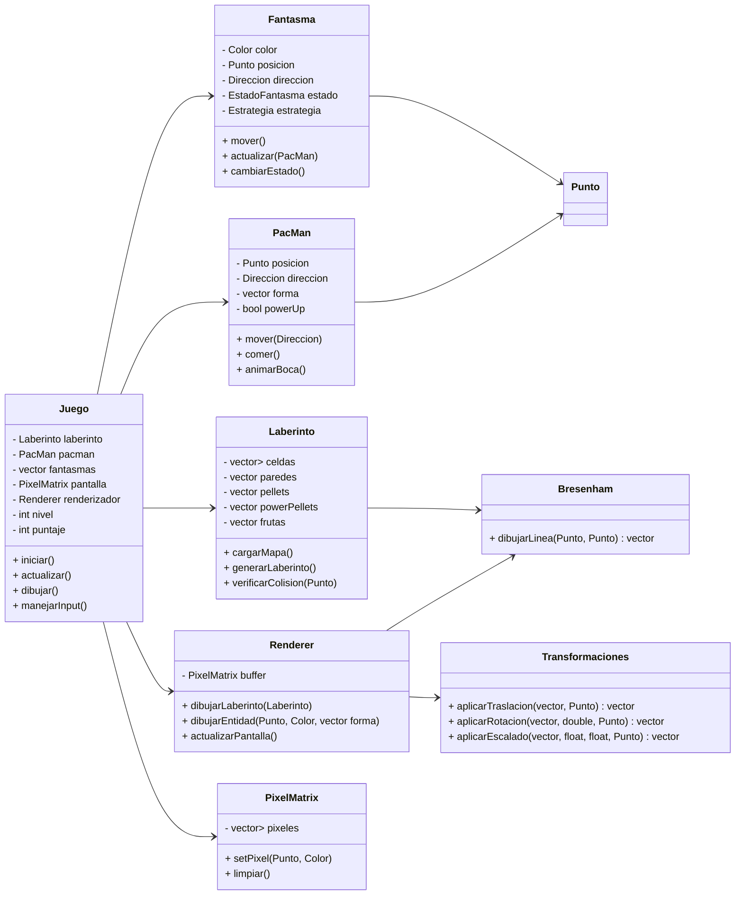

# Pacman

## Descripción del Juego

Pac-Man es un clásico juego de arcade lanzado en 1980 por Namco. Se caracteriza por un diseño simple pero con una jugabilidad rica en estrategia, patrones de movimiento y mecánicas bien definidas. Vamos a desglosar el juego en todos sus componentes, condiciones iniciales y reglas con el mayor nivel de detalle posible.

Pac-Man es un juego de laberinto en el que el jugador controla a Pac-Man, una criatura amarilla en forma de círculo con una boca que se abre y cierra, cuyo objetivo es recorrer un laberinto mientras come puntos y evita ser capturado por fantasmas. El juego tiene múltiples niveles, cada uno con un diseño idéntico del laberinto pero con un aumento en la dificultad debido a la velocidad de los enemigos.

---

### **2. Objetos en el Juego**
A continuación, se detallan todos los elementos presentes en el juego y su función:

#### **2.1. Pac-Man (El protagonista)**
- **Forma:** Circular, con una boca animada que se abre y cierra al moverse.
- **Movimiento:** Se desplaza en cuatro direcciones (arriba, abajo, izquierda, derecha) sin detenerse, solo cambia de dirección cuando el jugador lo indica.
- **Colisión con paredes:** Pac-Man no puede atravesar paredes y se mueve por caminos definidos.
- **Objetivo:** Comer todos los puntos del laberinto sin ser atrapado por los fantasmas.

#### **2.2. El Laberinto**
- **Tamaño fijo:** El laberinto es siempre el mismo en todas las partidas.
- **Diseño:** Contiene pasillos por donde Pac-Man y los fantasmas se pueden mover, además de paredes que delimitan el camino.
- **Puertas de túnel:** Existen dos pasajes en los laterales del laberinto que permiten a Pac-Man y a los fantasmas aparecer por el lado opuesto al entrar en uno.

#### **2.3. Puntos (Pellets)**
- **Cantidad:** Existen 240 puntos en el laberinto al inicio del juego.
- **Valor:** Cada punto vale 10 puntos.
- **Condición de victoria:** Para completar un nivel, Pac-Man debe comer todos los puntos.

#### **2.4. Súper Puntos (Power Pellets)**
- **Cantidad:** 4 en cada nivel, ubicados en las esquinas del laberinto.
- **Efecto:** Hacen que los fantasmas se vuelvan vulnerables y puedan ser comidos por Pac-Man.
- **Duración:** Varía según el nivel (se reduce en niveles avanzados).
- **Puntaje:** El primer fantasma comido vale 200 puntos, el segundo 400, el tercero 800 y el cuarto 1600.

#### **2.5. Fantasmas (Ghosts)**
Los fantasmas son los enemigos principales y cada uno tiene un comportamiento distinto basado en un conjunto de reglas predefinidas. Hay cuatro fantasmas en el juego:

| Fantasma  | Color  | Nombre Japonés | Estrategia |
|-----------|--------|---------------|------------|
| Blinky    | Rojo   | Oikake (Chase) | Persigue a Pac-Man directamente. |
| Pinky     | Rosa   | Machibuse (Ambush) | Intenta adelantarse a donde se moverá Pac-Man. |
| Inky      | Azul   | Kimagure (Fickle) | Movimiento impredecible, calculado con una combinación de Blinky y la posición de Pac-Man. |
| Clyde     | Naranja| Otoboke (Scatter) | A veces persigue a Pac-Man, otras veces huye a la esquina inferior izquierda. |

- **Estados de los fantasmas:**
  1. **Scatter Mode (Modo disperso)**: Se mueven a sus esquinas respectivas en intervalos definidos.
  2. **Chase Mode (Modo persecución)**: Intentan capturar a Pac-Man.
  3. **Frightened Mode (Modo vulnerable)**: Cuando Pac-Man come un Power Pellet, los fantasmas se vuelven azules y pueden ser comidos.
  4. **Eaten Mode (Modo de regreso)**: Cuando un fantasma es comido, regresa a la base (Ghost House) y reaparece en modo normal.

#### **2.6. Frutas (Bonos de puntos)**
- **Aparecen dos veces por nivel en la parte central del laberinto.**
- **Tipos de frutas y sus puntajes:**

| Fruta     | Nivel de aparición | Puntos |
|-----------|-------------------|--------|
| Cereza    | 1                 | 100    |
| Fresa     | 2                 | 300    |
| Naranja   | 3-4               | 500    |
| Manzana   | 5-6               | 700    |
| Uva       | 7-8               | 1000   |
| Galaxian  | 9-10              | 2000   |
| Campana   | 11-12             | 3000   |
| Llave     | 13+               | 5000   |

---

### **3. Condiciones Iniciales del Juego**
1. **Pac-Man comienza en la parte central inferior del laberinto.**
2. **Los fantasmas inician dentro de la "Ghost House" y salen después de unos segundos.**
3. **El juego comienza en el modo "Scatter" durante unos segundos antes de que los fantasmas entren en el modo de persecución.**
4. **El jugador tiene 3 vidas al inicio del juego.**
5. **El objetivo es comer todos los puntos del nivel para avanzar al siguiente.**
6. **Al obtener 10,000 puntos, el jugador recibe una vida extra.**

---

### **4. Lógica del Juego**
#### **4.1. Movimiento de Pac-Man**
- **El jugador usa las teclas de dirección para mover a Pac-Man.**
- **Pac-Man se mueve continuamente y solo cambia de dirección si no hay una pared en el camino.**
- **Si se encuentra con un Power Pellet, los fantasmas entran en el modo asustado.**

#### **4.2. Movimiento de los Fantasmas**
- **Cada fantasma tiene su propia lógica de movimiento.**
- **Alternan entre los modos "Scatter" y "Chase" según un temporizador.**
- **Si Pac-Man come un Power Pellet, los fantasmas se vuelven vulnerables y pueden ser comidos.**
- **Si un fantasma es comido, regresa a la Ghost House y reaparece.**

#### **4.3. Fin del Juego**
- **El juego termina si Pac-Man pierde todas sus vidas.**
- **Si el jugador termina un nivel, el siguiente comienza con la misma disposición del laberinto, pero los fantasmas se vuelven más rápidos.**
- **Después de cierto nivel, los Power Pellets dejan de afectar a los fantasmas.**

---

### **5. Estrategias y Patrones**
#### **5.1. Técnicas de Juego**
- **"Cornering"**: Aprovechar las esquinas para cambiar de dirección rápidamente.
- **"Ghost Grouping"**: Agrupar a los fantasmas para maximizar los puntos al comérselos.
- **"Pattern Exploitation"**: En los primeros niveles, los movimientos de los fantasmas son predecibles y pueden ser explotados con rutas óptimas.

#### **5.2. El Nivel de la Muerte (256)**
- **Pac-Man tiene un bug en el nivel 256** debido a un desbordamiento de memoria.
- **El lado derecho del laberinto aparece corrupto e imposible de jugar.**

---

### **6. Curiosidades**
- **Pac-Man fue diseñado para atraer a las jugadoras**, ya que la mayoría de los juegos en los 80 eran de disparos.
- **El nombre "Pac-Man" viene del japonés "Paku-Paku", que representa el sonido de abrir y cerrar la boca.**
- **El primer "Easter Egg" de videojuegos ocurrió en Pac-Man cuando se descubrió que los fantasmas seguían patrones predecibles.**

---

### **7. Conclusión**
Pac-Man es un juego de mecánicas simples pero con una gran profundidad estratégica. Su combinación de **movimiento de fantasmas**, **puntos**, **Power Pellets**, y **estrategias de evasión** lo han convertido en uno de los juegos más icónicos de la historia. 🚀

## Algoritmo

---

### **Explicación Detallada del Funcionamiento**

#### **1. Juego (Clase Principal)**
- **Atributos:**
  - `laberinto`: Contiene la estructura del mapa (paredes, pellets, powerPellets, frutas).
  - `pacman`: Instancia que representa al jugador.
  - `fantasmas`: Vector de fantasmas (Blinky, Pinky, Inky y Clyde) con comportamientos diferenciados.
  - `pantalla`: Una instancia de `PixelMatrix` que representa la pantalla.
  - `renderizador`: Encargado de dibujar el laberinto y entidades en la pantalla.
  - `nivel` y `puntaje`: Variables para gestionar la progresión y la puntuación del juego.
- **Métodos:**
  - `iniciar()`: Inicializa el juego, carga el laberinto, coloca a Pac-Man y los fantasmas.
  - `actualizar()`: Lógica principal del juego: mueve personajes, gestiona colisiones, actualiza estados (por ejemplo, modo asustado de los fantasmas).
  - `dibujar()`: Llama al renderizador para actualizar la pantalla utilizando `graphics.h` y la matriz de píxeles.
  - `manejarInput()`: Procesa las entradas del usuario para mover a Pac-Man.

#### **2. Laberinto**
- **Atributos:**
  - `celdas`: Estructura interna (opcional) que define el laberinto en celdas.
  - `paredes`: Coordenadas de las paredes (usadas para detectar colisiones).
  - `pellets` y `powerPellets`: Puntos que Pac-Man debe comer.
  - `frutas`: Objetos bonus que aparecen durante el juego.
- **Métodos:**
  - `cargarMapa()`: Lee o define el mapa del laberinto.
  - `generarLaberinto()`: Construye la estructura del laberinto.
  - `verificarColision(Punto)`: Verifica si un punto (por ejemplo, la posición de Pac-Man) colisiona con una pared.

#### **3. PacMan**
- **Atributos:**
  - `posicion`: Un objeto `Punto` que indica su ubicación.
  - `direccion`: Dirección actual (arriba, abajo, izquierda, derecha).
  - `forma`: Vector de `Punto` que define la forma de Pac-Man (útil para animación o colisiones).
  - `powerUp`: Indica si está en estado de poder (tras comer un powerPellet).
- **Métodos:**
  - `mover(Direccion)`: Actualiza la posición según la dirección, utilizando transformaciones (traslación).
  - `comer()`: Gestiona la acción de comer pellets.
  - `animarBoca()`: Controla la animación de apertura y cierre.

#### **4. Fantasma**
- **Atributos:**
  - `color`: Identifica a cada fantasma (por ejemplo, rojo para Blinky).
  - `posicion`: Su posición actual.
  - `direccion`: Dirección de movimiento.
  - `estado`: Puede ser normal, asustado o en regreso a la Ghost House.
  - `estrategia`: Algoritmo de movimiento (por ejemplo, perseguir, emboscar).
- **Métodos:**
  - `mover()`: Actualiza la posición basada en la estrategia.
  - `actualizar(PacMan)`: Ajusta su movimiento en función de la posición de Pac-Man.
  - `cambiarEstado()`: Alterna entre estados según las acciones del jugador.

#### **5. Renderer y PixelMatrix**
- **Renderer:**
  - Usa una `PixelMatrix` (o `buffer`) para almacenar los cambios y luego actualizar la pantalla de golpe con `graphics.h`.
  - Métodos:
    - `dibujarLaberinto(Laberinto)`: Dibuja el laberinto usando información de paredes y pellets.
    - `dibujarEntidad(Punto, Color, vector<Punto> forma)`: Dibuja entidades (Pac-Man, fantasmas) usando sus posiciones y formas.
    - `actualizarPantalla()`: Envía el buffer a la pantalla.
- **PixelMatrix:**
  - Representa la pantalla como una matriz 2D de píxeles, donde cada celda puede tener un color o estado.
  - Métodos:
    - `setPixel(Punto, Color)`: Cambia el color de un píxel.
    - `limpiar()`: Reinicia la matriz para el siguiente frame.

#### **6. Transformaciones y Bresenham**
- **Transformaciones:**
  - Proporciona métodos para aplicar traslación, rotación y escalado a vectores de puntos. Esto es útil para mover y animar a Pac-Man o los fantasmas.
- **Bresenham:**
  - Se utiliza para dibujar líneas (por ejemplo, para las paredes del laberinto) de forma eficiente.

---

### **Resumen**
El diagrama combinado anterior integra los detalles de ambos modelos:
- Se gestionan claramente las entidades principales del juego (Pac-Man, Fantasmas, Laberinto).
- Se define la lógica de renderizado a través de un buffer de píxeles y se encapsula en una clase `Renderer`.
- Se aprovechan las transformaciones y el algoritmo de Bresenham para dibujar y mover entidades.
- La clase `Juego` centraliza el flujo (inicialización, actualización, dibujo y manejo de entrada).

## Codificación

### Prepación del Entorno
### **1. IDE y Librerías**
**Instalar Visual Studio 2022**: Descargar e instalar Visual Studio 2022 Community Edition y Tener las librerías de gráficos instaladas. [Descargar Visual Studio 2022 y Usar graphics.h](https://github.com/jangelmm/graphics.h-en-Visual-Studio.git).]

### **2. Analisis de la Aplicación**
Se juego el videojuego Pacmana para analizar el comportamiento del mismo, así como planear la creación del mapa y la interacción de los personajes, para esto se siguió el siguiente orden

1. Dividir el mapa del juego en celdas de 28 x 31 cuadriculas.

2. A cada cuadricula le corresponde un valor, donde:
   - ` `: Espacio vacío
   - `#`: Pared
   - `.`: Pellet
   - `*`: Super Punto
   - `R, T, S, N`: Fantasma Rojo, Turquesa, Rosa y Naranja respectivamente.
   - `P`: Pacman

