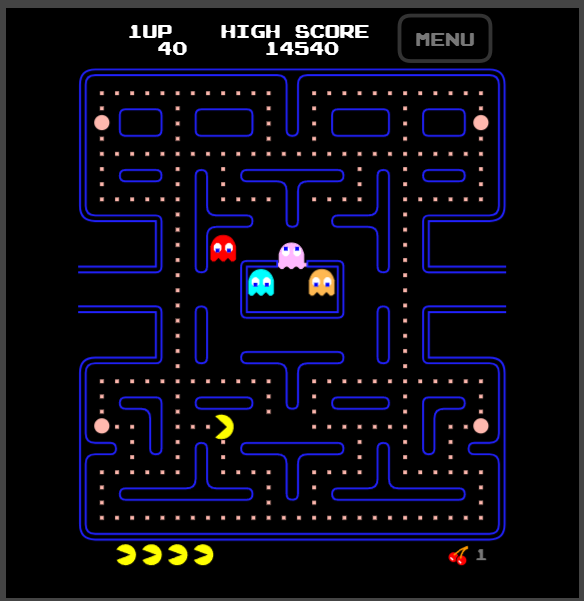
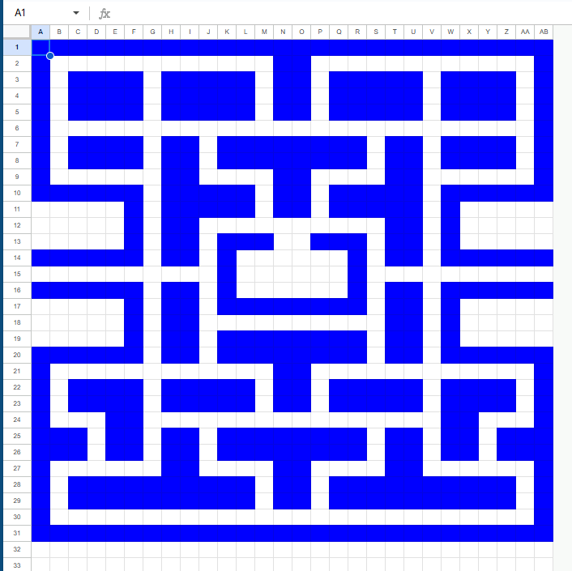
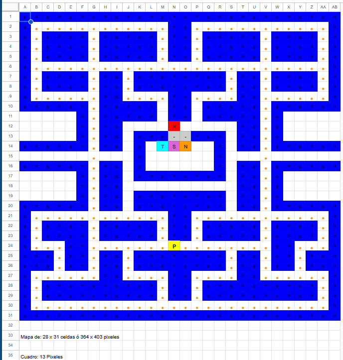

# Pacman

## Descripción del Juego

Pac-Man es un clásico juego de arcade lanzado en 1980 por Namco. Se caracteriza por un diseño simple pero con una jugabilidad rica en estrategia, patrones de movimiento y mecánicas bien definidas. Vamos a desglosar el juego en todos sus componentes, condiciones iniciales y reglas con el mayor nivel de detalle posible.


Pac-Man es un juego de laberinto en el que el jugador controla a Pac-Man, una criatura amarilla en forma de círculo con una boca que se abre y cierra, cuyo objetivo es recorrer un laberinto mientras come puntos y evita ser capturado por fantasmas. El juego tiene múltiples niveles, cada uno con un diseño idéntico del laberinto pero con un aumento en la dificultad debido a la velocidad de los enemigos.


### **2. Objetos en el Juego**
A continuación, se detallan todos los elementos presentes en el juego y su función:

#### **2.1. Pac-Man (El protagonista)**
- **Forma:** Circular, con una boca animada que se abre y cierra al moverse.
- **Movimiento:** Se desplaza en cuatro direcciones (arriba, abajo, izquierda, derecha) sin detenerse, solo cambia de dirección cuando el jugador lo indica.
- **Colisión con paredes:** Pac-Man no puede atravesar paredes y se mueve por caminos definidos.
- **Objetivo:** Comer todos los puntos del laberinto sin ser atrapado por los fantasmas.

#### **2.2. El Laberinto**
- **Tamaño fijo:** El laberinto es siempre el mismo en todas las partidas.
- **Diseño:** Contiene pasillos por donde Pac-Man y los fantasmas se pueden mover, además de paredes que delimitan el camino.
- **Puertas de túnel:** Existen dos pasajes en los laterales del laberinto que permiten a Pac-Man y a los fantasmas aparecer por el lado opuesto al entrar en uno.

#### **2.3. Puntos (Pellets)**
- **Cantidad:** Existen 240 puntos en el laberinto al inicio del juego.
- **Valor:** Cada punto vale 10 puntos.
- **Condición de victoria:** Para completar un nivel, Pac-Man debe comer todos los puntos.

#### **2.4. Súper Puntos (Power Pellets)**
- **Cantidad:** 4 en cada nivel, ubicados en las esquinas del laberinto.
- **Efecto:** Hacen que los fantasmas se vuelvan vulnerables y puedan ser comidos por Pac-Man.
- **Duración:** Varía según el nivel (se reduce en niveles avanzados).
- **Puntaje:** El primer fantasma comido vale 200 puntos, el segundo 400, el tercero 800 y el cuarto 1600.

#### **2.5. Fantasmas (Ghosts)**
Los fantasmas son los enemigos principales y cada uno tiene un comportamiento distinto basado en un conjunto de reglas predefinidas. Hay cuatro fantasmas en el juego:

| Fantasma  | Color  | Nombre Japonés | Estrategia |
|-----------|--------|---------------|------------|
| Blinky    | Rojo   | Oikake (Chase) | Persigue a Pac-Man directamente. |
| Pinky     | Rosa   | Machibuse (Ambush) | Intenta adelantarse a donde se moverá Pac-Man. |
| Inky      | Azul   | Kimagure (Fickle) | Movimiento impredecible, calculado con una combinación de Blinky y la posición de Pac-Man. |
| Clyde     | Naranja| Otoboke (Scatter) | A veces persigue a Pac-Man, otras veces huye a la esquina inferior izquierda. |

- **Estados de los fantasmas:**
  1. **Scatter Mode (Modo disperso)**: Se mueven a sus esquinas respectivas en intervalos definidos.
  2. **Chase Mode (Modo persecución)**: Intentan capturar a Pac-Man.
  3. **Frightened Mode (Modo vulnerable)**: Cuando Pac-Man come un Power Pellet, los fantasmas se vuelven azules y pueden ser comidos.
  4. **Eaten Mode (Modo de regreso)**: Cuando un fantasma es comido, regresa a la base (Ghost House) y reaparece en modo normal.

#### **2.6. Frutas (Bonos de puntos)**
- **Aparecen dos veces por nivel en la parte central del laberinto.**
- **Tipos de frutas y sus puntajes:**

| Fruta     | Nivel de aparición | Puntos |
|-----------|-------------------|--------|
| Cereza    | 1                 | 100    |
| Fresa     | 2                 | 300    |
| Naranja   | 3-4               | 500    |
| Manzana   | 5-6               | 700    |
| Uva       | 7-8               | 1000   |
| Galaxian  | 9-10              | 2000   |
| Campana   | 11-12             | 3000   |
| Llave     | 13+               | 5000   |

---

### **3. Condiciones Iniciales del Juego**
1. **Pac-Man comienza en la parte central inferior del laberinto.**
2. **Los fantasmas inician dentro de la "Ghost House" y salen después de unos segundos.**
3. **El juego comienza en el modo "Scatter" durante unos segundos antes de que los fantasmas entren en el modo de persecución.**
4. **El jugador tiene 3 vidas al inicio del juego.**
5. **El objetivo es comer todos los puntos del nivel para avanzar al siguiente.**
6. **Al obtener 10,000 puntos, el jugador recibe una vida extra.**

---

### **4. Lógica del Juego**
#### **4.1. Movimiento de Pac-Man**
- **El jugador usa las teclas de dirección para mover a Pac-Man.**
- **Pac-Man se mueve continuamente y solo cambia de dirección si no hay una pared en el camino.**
- **Si se encuentra con un Power Pellet, los fantasmas entran en el modo asustado.**

#### **4.2. Movimiento de los Fantasmas**
- **Cada fantasma tiene su propia lógica de movimiento.**
- **Alternan entre los modos "Scatter" y "Chase" según un temporizador.**
- **Si Pac-Man come un Power Pellet, los fantasmas se vuelven vulnerables y pueden ser comidos.**
- **Si un fantasma es comido, regresa a la Ghost House y reaparece.**

#### **4.3. Fin del Juego**
- **El juego termina si Pac-Man pierde todas sus vidas.**
- **Si el jugador termina un nivel, el siguiente comienza con la misma disposición del laberinto, pero los fantasmas se vuelven más rápidos.**
- **Después de cierto nivel, los Power Pellets dejan de afectar a los fantasmas.**

---

### **5. Estrategias y Patrones**
#### **5.1. Técnicas de Juego**
- **"Cornering"**: Aprovechar las esquinas para cambiar de dirección rápidamente.
- **"Ghost Grouping"**: Agrupar a los fantasmas para maximizar los puntos al comérselos.
- **"Pattern Exploitation"**: En los primeros niveles, los movimientos de los fantasmas son predecibles y pueden ser explotados con rutas óptimas.

#### **5.2. El Nivel de la Muerte (256)**
- **Pac-Man tiene un bug en el nivel 256** debido a un desbordamiento de memoria.
- **El lado derecho del laberinto aparece corrupto e imposible de jugar.**

---

### **6. Curiosidades**
- **Pac-Man fue diseñado para atraer a las jugadoras**, ya que la mayoría de los juegos en los 80 eran de disparos.
- **El nombre "Pac-Man" viene del japonés "Paku-Paku", que representa el sonido de abrir y cerrar la boca.**
- **El primer "Easter Egg" de videojuegos ocurrió en Pac-Man cuando se descubrió que los fantasmas seguían patrones predecibles.**

## Codificación

### Prepación del Entorno
### **1. IDE y Librerías**
**Instalar Visual Studio 2022**: Descargar e instalar Visual Studio 2022 Community Edition y Tener las librerías de gráficos instaladas. [Descargar Visual Studio 2022 y Usar graphics.h](https://github.com/jangelmm/graphics.h-en-Visual-Studio.git).]

### **2. Analisis de la Aplicación**
Se jugo el videojuego Pacman para analizar el comportamiento del mismo, así como planear la creación del mapa y la interacción de los personajes, para esto se siguió el siguiente orden



1. Dividir el mapa del juego en celdas de 28 x 31 cuadriculas.



2. A cada cuadricula le corresponde un valor, donde:
   - ` `: Espacio vacío
   - `#`: Pared
   - `.`: Pellet
   - `*`: Super Punto
   - `R, T, S, N`: Fantasma Rojo, Turquesa, Rosa y Naranja respectivamente.
   - `P`: Pacman




## Algoritmo

### Definir la matriz de caracteres que incluirá nuestrá lógica
Definir la matriz inicial de Elementos con caracteres `mapa`

```
#define ROWS 31
#define COLS 28

const char* mapa[ROWS] = {
    "############################",
    "#............##............#",
    "#.####.#####.##.#####.####.#",
    "#*####.#####.##.#####.####*#",
    "#.####.#####.##.#####.####.#",
    "#..........................#",
    "#.####.##.########.##.####.#",
    "#.####.##.########.##.####.#",
    "#......##....##....##......#",
    "######.##### ## #####.######",
    "     #.##### ## #####.#     ",
    "     #.##    R     ##.#     ",
    "     #.## ###--### ##.#     ",
    "######.## # TSN  # ##.######",
    "      .   #      #   .      ",
    "######.## #      # ##.######",
    "     #.## ######## ##.#     ",
    "     #.##          ##.#     ",
    "     #.## ######## ##.#     ",
    "######.## ######## ##.######",
    "#............##............#",
    "#.####.#####.##.#####.####.#",
    "#.####.#####.##.#####.####.#",
    "#*..##.......P........##..*#",
    "###.##.##.########.##.##.###",
    "###.##.##.########.##.##.###",
    "#......##....##....##......#",
    "#.##########.##.##########.#",
    "#.##########.##.##########.#",
    "#..........................#",
    "############################"
};
```

El `#` represetna a una pared del juego, estas son constantes en el mapa.
El `.` representa un pallet que puede ser comido por Pacman.
El `*` representa un super pallet que puede ser comido por Pacman.
El `R` representa al fantasma Rojo.
El `T` representa al fantasma Turquesa.
El `S` representa al fantasma Rosa.
El `N` representa al fantasma Naranja.
El `P` representa a Pacman.
El `-` representa la puerta de donde se encuentran los fantasmas.`

### 2. Graficar los elementos de la matriz lógica

Imprimir el contenido actual de la matriz con un bucle

Ahora haremos lo siguiente:

Para este apartado haremos uso de la Programación Orientada a Objetos, donde tendremos el objeto Pared, Punto, SuperPunto, Fantasma y Pacman, cada uno con sus respectivos atributos y métodos.

Iterando la matriz mapa
- segun el caracter en (i,j)
- `#` llamar el método estatico dibujar de la clase Graficar que resibirá un objeto de la clase Pared
- `.` llamar el método estatico dibujar de la clase Graficar que resibirá un objeto de la clase Pallet
- `*` llamar el método estatico dibujar de la clase Graficar que resibirá un objeto de la clase SuperPallet
- `R` llamar el método estatico dibujar de la clase Graficar que resibirá un objeto de la clase Fantasma
- `T` llamar el método estatico dibujar de la clase Graficar que resibirá un objeto de la clase Fantasma
- `S` llamar el método estatico dibujar de la clase Graficar que resibirá un objeto de la clase Fantasma
- `N` llamar el método estatico dibujar de la clase Graficar que resibirá un objeto de la clase Fantasma`
- `P` llamar el método estatico dibujar de la clase Graficar que resibirá un objeto de la clase Pacman; si la iteracion es divisible entre 0,1,2, o 9 dibujará a pacman con la boca cerrada (Figura 1), si la iteración es divisible entre 3,4, o 5 dibujará a pacman con la boca semiabierta (Figura 2), si la iteración es divisible entre 6,7, u 8 dibujará a pacman con la boca abierta (Figura 3). 


### 3. Modificar los elementos de la matriz lógica 

La matriz llamda `mapa` se actualiza tras cada iteración
Iteración i inicia en 0
   
	- La letra P (Pacman) se mueve en la matriz según la tecla pulsada por el Usuario (W, A, S, D)
	- El fantasma color Rojo R se mueve de forma aleatoria por el trablero usa su función mover()
	- El fantasma de color Rosa S sale del cuadro donde se encuentran tras 5 iteraciones
	- El fantasma de color Azul Turquesa T sale del cuadro donde se encuentran tras 25 iteraciones
	- El fantasma de color Naranja N sale del cuadro donde se encuentran tras 50 iteraciones
	Por ahora todos los fantasmas usan su función mover() que será de forma aleatoria, en lo que se programa un major algoritmo.
   
Si un fantasma toca o se sobre pone con Pacman, se termina el juego.

Los elementos pueden moverse en cualquier posición del mapa sin embargo no pueden sobreponerse sobre una pared o atravesarlas `#`, por otro lado pacman
si se encuenta con un `.` este se borra y aumenta el puntaje de Pacman, si se encuentra con un `*` los fantasmas cambian de color a blanco, esto indica que pueden ser comidos por Pacman, si Pacman se come a un fantasma, este regresa a su posición inicial.


## Clases y Métodos
Clase Punto: Tendra artibutros x,y que representan coordenadas y getters y setters
Clase Pared: Tendra un atributo de tipo Punto, color y una matriz de 13x13 pixeles, será de color azul
```
#############
#############
#############
#############
#############
#############
#############
#############
#############
#############
#############
#############
#############
```

Clase Pallet: Tendra un atributo de tipo Punto y color y una matriz de 13x13 pixeles será de color naranja
```
             
             
             
             
     222     
     222     
     222     
             
             
             
             
```

Clase super Pallet: Tenra un atributo de tipo Punto, color y una matriz de 13x13 pixeles será de color blanco
```
             
             
             
    22222    
    22222    
    22222    
    22222    
    22222    
             
             
             
```

Clase Fantasma: Tendra un atributo de tipo Punto, color y una matriz de 13x13 pixeles será el color lo define el constructor, en todo lugar donde haya un 1, se mostrará el color del fantasma

```
    11111    
  111111111  
 11111111111 
 11111111111 
 11111111111 
1111111111111
1111111111111
1111111111111
1111111111111
1111111111111
1111111111111
111 11111 111
 1   1 1   1
```

Clase Pacman: Tendra un atrobuto Punto, color y una matriz de 13x13 pixeles será de color amarillo, en todo lugar donde haya un 1, se mostrará el color del pacman (amarrillo)}

Figura 1
```
    11111    
  111111111  
 11111111111
 11111111111 
1111111111111
1111111111111
1111111111111
1111111111111
1111111111111
 11111111111 
 11111111111 
  111111111  
    11111    
```

Figura 2
```
    11111    
  111111111  
 11111111111 
 11111111111 
1111111111   
1111111      
1111         
1111111      
11111111111 
 11111111111 
 11111111111 
  111111111  
    11111    
```

Figura 3
```
    1111111  
  111111111  
 111111111   
 11111111    
1111111      
11111        
1111
11111        
1111111      
 11111111    
 111111111   
  111111111  
    1111111    
````

Clase Graficar usará la matriz del objeto, pero lo gráficara usando el algoritmo de Bresenham, el de Traslación, Rotación, Escalado.
Dependiendo del numero 
1:  Pinta con el color del objeto en la matriz de 13x13 pixeles
2: Pinta de color azul
3: Pinta de color Blanco 


En el caso del pacman el de rotación será usado según la última tecla pulsada por el usuario o la dirección hacia la que va el pacman.
El resto de objetos se dibujan igual en la pantalla.

### Otros algoritmos
