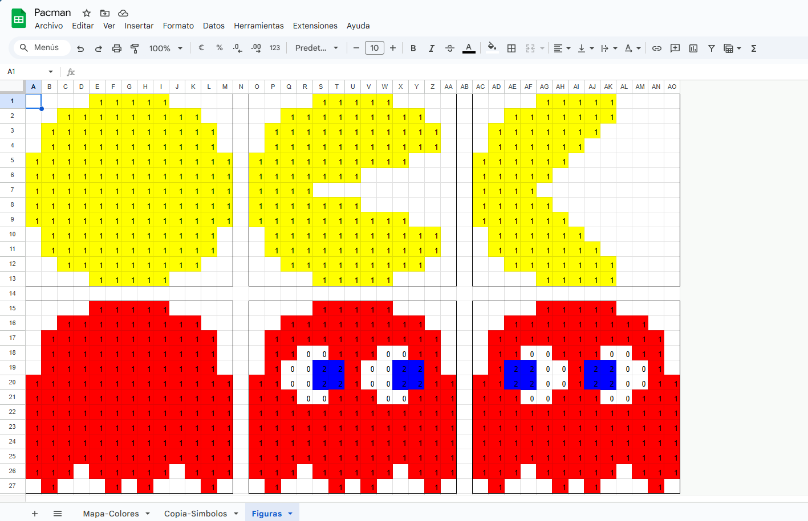
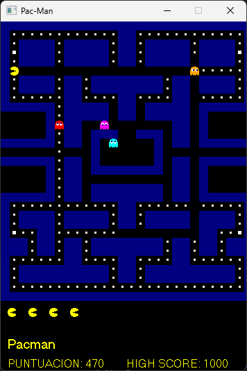


# Pac-Man

## Información del Proyecto

**Creadores:**

- Diego García Jennifer
- Martínez Mendoza Jesús Ángel
- Caballero García Nayeli Itzel

**Asignatura:** Graficación Por Computadoras  

**Institución:** TecNM Campus Oaxaca - Instituto Tecnológico de Oaxaca  

**Docente:** Matadamas Ortiz Idarh Claudio

**Periodo:** ENE-JUN, 2025

---

## Descripción del Juego

Pac-Man es un clásico videojuego de arcade lanzado originalmente en 1980 por Namco. El juego se centra en el control de Pac-Man, una figura amarilla que se desplaza por un laberinto comiendo pellets y evitando a cuatro fantasmas de colores (Rojo, Turquesa, Rosa y Naranja). A lo largo del juego, se introducen elementos como súper pellets, que, al ser consumidos, permiten a Pac-Man volverse temporalmente capaz de comer a los fantasmas.

El objetivo principal es recorrer el laberinto, comer todos los pellets y evitar ser capturado por los fantasmas. El juego incrementa su dificultad en niveles sucesivos, modificando la velocidad y patrones de los enemigos.


---

## Estructura del Proyecto

El proyecto está diseñado usando Programación Orientada a Objetos y se compone de múltiples clases que representan los distintos elementos del juego:

- **Punto:** Representa coordenadas (x, y) y es la base para la ubicación de todos los objetos.    
- **Pared:** Representa los muros del laberinto. Cada pared se dibuja como una celda de 13x13 píxeles, con un color fijo (azul).
- **Pallet:** Representa los pellets comunes que Pac-Man debe comer. Se dibujan con un diseño reducido en una celda de 13x13, con un color (naranja).
- **SuperPallet:** Representa los súper pellets (power pellets) que otorgan a Pac-Man la habilidad de comer fantasmas. Se dibujan en blanco.
- **Fantasma:** Representa a cada uno de los enemigos. Cada fantasma posee un color y una matriz de 13x13 que determina su apariencia.
- **Pac-Man:** Representa al protagonista, con distintas figuras de animación (boca cerrada, semiabierta y abierta) que se muestran en función del estado de animación.
- **Graficar:** Esta clase se encarga de tomar la “matriz lógica” de cada objeto y dibujarla en la pantalla. Se apoya en algoritmos de transformación (rotación, escalado y traslación) y, opcionalmente, en el algoritmo de Bresenham para dibujar líneas o contornos.

Adicionalmente, se incluyen clases de transformación geométrica:

- **Rotacion:** Rota un conjunto de puntos alrededor de un pivote.
- **Escalado:** Redimensiona un conjunto de puntos según factores de escala.
- **Traslacion:** Desplaza un conjunto de puntos.
- **(Bresenham):** Permite dibujar líneas entre puntos (opcional para contornear figuras).    

---

## Algoritmo Lógico

La lógica del juego se basa en el uso de una matriz de caracteres que representa el laberinto. Cada celda de la matriz (definida como 28 columnas por 31 filas) contiene un carácter que indica el tipo de elemento:


- `#`: Pared.    
- `.`: Pellet.
- `*`: Súper Pellet.
- `R`, `T`, `S`, `N`: Fantasmas (Rojo, Turquesa, Rosa y Naranja, respectivamente).
- `P`: Pac-Man.
- `-`: Puerta del "Ghost House" (donde se encuentran los fantasmas).


**Lógica del juego:**

- La matriz lógica se procesa iterativamente; cada celda se evalúa y se instancia un objeto de la clase correspondiente.
- La manipulación de la matriz permite simular el movimiento de los personajes. Por ejemplo:
    - Al mover a Pac-Man (según entrada del usuario con teclas W, A, S, D), se actualiza su posición en la matriz.
    - Si Pac-Man se mueve a una celda con un pellet (`.`), el pellet se elimina de la matriz y se incrementa el puntaje.   
    - Si se topa con una pared (`#`), el movimiento se invalida.
    - Los fantasmas se mueven de forma aleatoria (o siguiendo un algoritmo más sofisticado), y si entran en colisión con Pac-Man, se termina el juego.
- Esta separación entre la lógica (la matriz de caracteres) y la representación gráfica permite simular el juego de forma simplificada, concentrándose en la mecánica de colisiones, movimiento y actualización de estados.

```
"############################",
"#............##............#",
"#.####.#####.##.#####.####.#",
"#*####.#####.##.#####.####*#",
"#.####.#####.##.#####.####.#",
"#..........................#",
"#.####.##.########.##.####.#",
"#.####.##.########.##.####.#",
"#......##....##....##......#",
"######.##### ## #####.######",
"     #.##### ## #####.#     ",
"     #.##    R     ##.#     ",
"     #.## ###--### ##.#     ",
"######.## # TSN  # ##.######",
"      .   #      #   .      ",
"######.## #      # ##.######",
"     #.## ######## ##.#     ",
"     #.##          ##.#     ",
"     #.## ######## ##.#     ",
"######.## ######## ##.######",
"#............##............#",
"#.####.#####.##.#####.####.#",
"#.####.#####.##.#####.####.#",
"#*..##.......P........##..*#",
"###.##.##.########.##.##.###",
"###.##.##.########.##.##.###",
"#......##....##....##......#",
"#.##########.##.##########.#",
"#.##########.##.##########.#",
"#..........................#",
"############################"
```

---

## Algoritmo de Graficación

La parte gráfica se encarga de transformar la representación lógica (la matriz de caracteres) en dibujos en pantalla. Los pasos principales son:

1. **Interpretación de la matriz lógica:**  
    Cada objeto posee una matriz de 13x13 caracteres que define su "sprite". Por ejemplo, la matriz de Pac-Man varía según el estado de animación (boca cerrada, semiabierta o abierta).

```
    11111    
  111111111  
 11111111111 
 11111111111 
1111111111   
1111111      
1111         
1111111      
11111111111 
 11111111111 
 11111111111 
  111111111  
    11111    
```

Se guarda su forma en un Vector.

```
vector<string> matrizDerecha = {
	"    11111    ",
	"  111111111  ",
	" 11111111111 ",
	" 11001110011 ",
	" 10022100221 ",
	"1100221002211",
	"1110011100111",
	"1111111111111",
	"1111111111111",
	"1111111111111",
	"1111111111111",
	"111 11111 111",
	" 1   1 1   1"
};
```

- `1`: Color dado por el constructor
- `0`: Color blanco
- `2`: Color azul

Para ver todos ver todos los objetos click en [Diseño de Objetos](https://docs.google.com/spreadsheets/d/17pzVTPVUb-rS6HZ2om61W8trHnrEx1gxkTmlStIjyyQ/edit?usp=sharing).
    


2. **Transformación geométrica:**  
    La clase **Graficar** se encarga de:
    - Convertir la matriz de cada Objeto en un conjunto de puntos (usando la clase **Punto**), esto se explica más adelante.
    - Aplicar transformaciones mediante las clases **Rotacion**, **Escalado** y **Traslacion** para ajustar la figura a la posición y orientación deseada.
    - Dibujar los puntos resultantes en pantalla utilizando la librería **graphics.h**.
    
Se utiliza un algoritmo  para asegurar que cada celda de la matriz se dibuje en un área de 13x13 píxeles. Esto permite mantener la consistencia visual, ya que cada objeto se dibuja a escala y en la posición correcta.
    
3. **Doble Buffer y Sincronización:**  
    Para evitar parpadeos, se utiliza la técnica de doble buffer. El mapa estático se dibuja una sola vez y se almacena en un buffer de imagen, el cual se reutiliza en cada iteración. Los elementos dinámicos (Pac-Man y los fantasmas) se actualizan sobre ese fondo, logrando una animación fluida.
    
4. **Algoritmo de Bresenham:**  
    Se emplea para rellenar los objetos al graficar.
    

---

## Etapas del Desarrollo

### 1. Análisis y Diseño

- **Definición de la matriz lógica:**  
    Se diseñó una matriz de 31 filas por 28 columnas en la que cada carácter define un elemento del juego.    
- **Diseño orientado a objetos:**  
    Se identificaron las clases necesarias (Punto, Pared, Pallet, SuperPallet, Fantasma, Pacman y Graficar) y se definieron sus atributos y métodos, incluyendo una matriz de 13x13 en donde se dibuja su forma, posteriormente estos valores se convierten a puntos, para hacer operaciones con ellos.
- **Graficación**
	Al saber que objeto hay en cada posición de la matriz del mapa, se llama a la clase `Graficacion` para que dibuje en esa zona, que se encarga de convertir la matriz del objeto a puntos, operar con ellos, y dibujarlo en esa posición.
- **Planificación de algoritmos:**  
    Se establecieron los algoritmos de transformación geométrica (rotación, escalado y traslación) para usarlos en la representación gráfica.

### 2. Implementación

- **Lógica del juego:**  
    Se implementó la actualización de la matriz lógica para mover a Pac-Man y los fantasmas, además de gestionar colisiones y actualizaciones (por ejemplo, al comer pellets).
- **Graficación:**  
    Se implementó la clase Graficar para interpretar la matriz de cada objeto y dibujarlo en pantalla. Se integraron técnicas de doble buffer para evitar parpadeos.
- **Integración de algoritmos geométricos:**  
    Se añadieron las clases Rotacion, Escalado y Traslacion, permitiendo aplicar transformaciones a las figuras antes de ser dibujadas.

### 3. Compilación y Ejecución

- **Entorno de Desarrollo:**  
    Se utiliza Visual Studio 2022 en un entorno Windows 11.
- **Configuración:**  
    Se incluyen las librerías necesarias (como graphics.h) y se configura el proyecto para compilar en modo x86.
- **Compilación:**  
    El proyecto se compila en Visual Studio sin errores y se vincula la librería graphics.lib mediante la directiva `#pragma comment(lib, "graphics.lib")`.
- **Ejecución:**  
    Al ejecutar el proyecto, se abre una ventana centrada en la pantalla (si se configuran las coordenadas adecuadamente) y se inicia el juego con la animación y lógica definida.



>Para mover a Pacman use las teclas `W, A, S, D`

## Ejecución

Para descargar y usar el juego siga las siguientes instrucciones.

### Ejecutable

En este mismo repositorio navegue a...

```
\Debug
```

Descargue el archivo `Pacman.exe`, de doble clic para ejecutar.

### Usando Visual Studio Code

Clone el repositorio, y ejecute el archivo `Pacman.cpp`.

```
https://github.com/jangelmm/Pacman.git
```

## Anexos
- Descargar e instalar Visual Studio 2022 Community Edition y Tener las librerías de gráficos instaladas. [Descargar Visual Studio 2022 y Usar graphics.h](https://github.com/jangelmm/graphics.h-en-Visual-Studio.git).